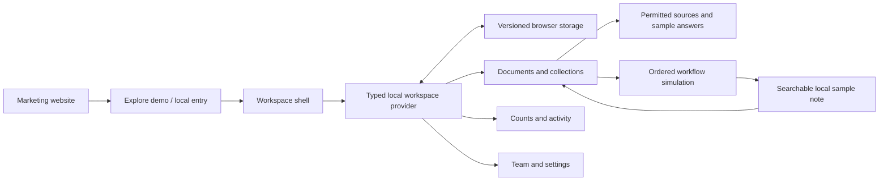

# NEXA — From scattered documents to traceable answers

**Concept Project · SaaS marketing website + interactive knowledge workspace**

NEXA is a fictional product designed and implemented to demonstrate how a marketing promise can connect to a usable application. The delivered demo runs locally, persists browser state, and uses explicit sample answers and workflow simulations. It does not represent an operating company or a released AI service.

## Problem

The design premise is that small product and operations teams keep decisions across handovers, plans, research notes, and process documents. Finding information is only part of the job: people also need to see where an answer came from and what action follows.

This is a product hypothesis illustrated by fictional scenarios. No customer interviews, market research results, adoption figures, revenue, or measured productivity improvements are claimed. The document titled “Customer interview synthesis” is sample content within the demo, not evidence of real research.

## Product concept

**“Turn scattered project documents into answers your team can trace.”**

NEXA connects four tasks: collect source material, organize it into collections, inspect prepared answers with supporting passages, and turn a supported example into a sample digest and action list. The same local document library appears in Documents, Knowledge base, Chat context, Workflows, and Overview.

The core demonstration uses Project Atlas: inspect the handover, ask what blocks release, open the supporting accessibility passage, and simulate a document-to-note workflow. A successful run creates an actual local Markdown note that can be found in the document library. An unsupported source produces a recoverable failure with instructions to choose a supported example.

## Target users

| Hypothetical audience | Job illustrated in the demo |
| --- | --- |
| Product managers and project leads | Trace a release decision to a handover and prepare next actions. |
| Operations coordinators | Organize procedures and inspect how file handling is explained in a runbook. |
| Research and design teams | Find source expectations in a fictional synthesis and preserve references. |
| Startup and business clients viewing the portfolio | Assess connected product UX, frontend behavior, and implementation discipline. |

The fictional Northstar Studio workspace supplies context for these tasks. Its five members, 12 documents, four collections, three workflows, and historical sample activity are illustrative, not real customers.

## Business model concept

NEXA presents an illustrative subscription model in USD per workspace per month:

| Tier | Monthly concept rate | Annual concept rate displayed per month | Positioning |
| --- | --- | --- | --- |
| Free | $0 | $0 | Explore a small workspace and basic organization. |
| Team | $24 | $19 | Shared source-linked answers, templates, and usage insights. |
| Business | $59 | $49 | Proposed permission, support, usage, and integration options. |

These tiers show packaging and pricing UX. Advertised tier capabilities are concepts; the demo does not enforce usage limits or sell subscriptions. There is no payment form, checkout, revenue forecast, or assertion that the rates have been validated by a market.

## Marketing website strategy

The primary conversion is **Explore demo**, available from navigation, the hero, pricing, and contextual calls to action. It takes visitors directly into the product. Login and signup offer optional local personalization without a password or real account.

The homepage leads with a specific outcome and real interactive UI. Visitors can search three sample documents and inspect their contents before entering the workspace. The document-to-answer walkthrough explains collection, discovery, sources, and action. Use cases place these capabilities in concrete work situations. A pricing preview introduces the concept business model.

The Product page expands the connected experience through reusable product components and a diagram. Features are grouped by collecting, finding, understanding, and acting. Integrations are explicitly proposed. The secondary demo-request form validates input, prepares copyable text, and states **not sent**. No fictional testimonials, customer logos, user counts, or performance guarantees are used.

Possible future evaluation would measure demo entry, completion of the source-inspection journey, and workflow task success in real usability sessions. Those measurements have not been collected.

## Dashboard architecture

Next.js App Router provides route boundaries. The application layout mounts a shared workspace provider and navigation shell. Each workspace view reads the same typed state and calls explicit actions. Updates propagate across routes and persist under a versioned localStorage key.

The overview combines current library counts, local questions/runs, collection distribution, recent material, workflow status, and an activity feed. The historical chart is labeled sample data and is separate from current browser activity. Analytics supplies date-range controls, numeric summaries, and a table alternative to its lightweight CSS chart.

There is no unnecessary API layer. File reading, search, sample answers, and workflow simulation are deterministic local operations. Unavailable storage keeps the workspace usable in memory with a visible notice. Invalid saved data provides a reset action.

## Information architecture

| Navigation group | Pages and purpose |
| --- | --- |
| Marketing discovery | Home, Product, Features, Use cases, Integrations, Pricing. |
| Entry and contact intent | Login, Signup, Demo request; all local presentation flows. |
| Workspace | Overview, Documents, Knowledge base, AI chat, Workflows, Analytics. |
| Manage | Team and Settings. |

Collections provide stable context across the library and knowledge screens. Documents expose type, owner, date, size, state, plain text, and membership in a detail dialog. Chat keeps conversation history alongside the current answer. Workflows keeps selectable flows beside the step editor, with execution controls and a local run log below it.

The structure separates discovery, daily work, and preferences while preserving a clear route back to the public website.

## Design system

The visual direction is light and technical: off-white canvases, graphite navigation, restrained teal, thin borders, aligned grids, and compact monospace metadata. The marketing headline uses an expressive italic serif phrase inside an otherwise precise typographic system. Manrope is packaged locally for interface text.

| Role | Token / treatment |
| --- | --- |
| Main text | `--ink: #1c2927` |
| Supporting text | `--muted: #62716d`, with contextual contrast adjustments. |
| Canvas | `--paper: #f7f8f5` |
| Surface / border | White surfaces; `--line: #dce4df`. |
| Primary accent | `--teal: #0e7569`, dark `#07584e`, soft `#e5f4ef`. |
| Metadata | Monospace uppercase labels and compact dates, with readable body text. |
| Layout | Centered marketing container; fixed desktop navigation column and flexible app content. |

Reusable primitives include button variants, labeled fields, search/select patterns, surfaces, tables, navigation, keyboard-operated tabs, segmented controls, badges, native dialog wrappers, skeletons, empty states, and status/error notices. The analytics tabs support arrow keys, Home, End, and a labeled content panel. Focus rings are visible. Selected states use more than a color cue through text, borders, position, and semantic attributes.

Motion supports drawer opening, loading feedback, and step progress. Reduced-motion preferences suppress animation and transitions, and chat scrolling uses an immediate behavior. Charts use lightweight markup rather than a large visualization dependency.

## AI interaction design

The chat presents **sample mode** before a question is entered. Suggested prompts make supported behavior discoverable. A context selector limits the document set. Each curated answer cites a passage that exists in a permitted document; the source control opens its original plain text.

Unsupported questions produce an honest explanation and prepared prompts. No fabricated citation or accuracy percentage appears. A deleted source disables its citation control and identifies the missing document. Uploaded text supports local preview/search, but is never sent to an AI model.

Workflow UX uses a visible ordered sequence: **Document added → Summarize → Extract action items → Add workspace note**. Required order and configuration are validated before running. Brief step progress, clearly labeled sample output, a run history, and retry instructions explain state changes. The enabled flag is local concept state; there is no scheduled automation. Supported seed documents provide curated output, and the note step creates a real local document.

## Responsive approach

The six target widths are 375, 390, 430, 768, 1024, and 1440 px. Marketing grids collapse progressively; the hero stacks without losing the interactive document preview. Small preview layouts prioritize document search and inspection while the full chat remains available in the app.

At 768 px and below, the dashboard sidebar becomes a drawer. Closed navigation is inert; opened navigation traps focus and returns focus to its trigger on Escape. Mobile document rows become labeled cards rather than forcing a wide table onto the page. Chat history stacks above the conversation, and source content uses a modal that fits the viewport. Workflow columns stack, with step controls still available. Team and analytics tables constrain horizontal scrolling to their own regions.

All 17 routes were tested for page overflow at all six widths. Screenshots support visual inspection of marketing and dashboard layouts at those widths; separate mobile document and workflow captures show the dense product adaptations. See the QA report for the exact verification scope and limits.

## Technology

| Layer | Choice and reason |
| --- | --- |
| Framework | Next.js 16 App Router; server-rendered marketing with isolated client interactions. |
| UI | React 19, strict TypeScript, Tailwind CSS 4, custom CSS tokens, Lucide icons. |
| Fonts | Locally packaged Manrope; system serif and monospace for selected roles. |
| Data | Typed models and a shared React provider, versioned browser storage, deterministic helpers. |
| Testing | Node test runner via tsx, Playwright against the production build, axe, Lighthouse. |
| Packaging | Independent npm package and lockfile, isolated configuration, dedicated port 3213. |

Webpack is used because Turbopack failed in the supplied Windows folder path. Parent portfolio tooling overlap was inspected and documented without changing parent configuration. The application requires no keys or backend services.

## What This Project Demonstrates

- Product strategy translated into concrete tasks, navigation, packaging, and conversion paths.
- SaaS marketing design supported by real interactive product UI.
- Connected application design across eight screens and shared state.
- Document preview, search, filtering, sorting, membership, persistence, and recovery.
- Source-aware example-answer UX with clear simulation and unsupported states.
- Ordered workflow editing, validation, progress, sample results, failure/retry, and local note creation.
- Responsive tables, mobile navigation, keyboard focus handling, and accessible chart alternatives.
- Frontend implementation with typed models, scoped configuration, browser verification, and evidence artifacts.

This demonstrates a functional frontend concept and product architecture. It does not claim production authentication, live AI, a deployed service, real customers, or enforced team security.

## Finished application captures

| View | Screenshot |
| --- | --- |
| SaaS hero | [saas-hero.png](artifacts/screenshots/saas-hero.png) |
| Product section | [product-section.png](artifacts/screenshots/product-section.png) |
| Dashboard | [dashboard.png](artifacts/screenshots/dashboard.png) |
| AI chat | [ai-chat.png](artifacts/screenshots/ai-chat.png) |
| Workflow builder and sample run | [workflow-builder.png](artifacts/screenshots/workflow-builder.png) |
| Mobile website | [mobile-website.png](artifacts/screenshots/mobile-website.png) |

Refer to [README.md](README.md) for setup and [QA-REPORT.md](QA-REPORT.md) for measured validation and demo limitations.
